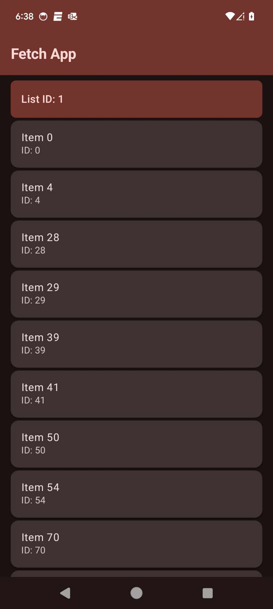
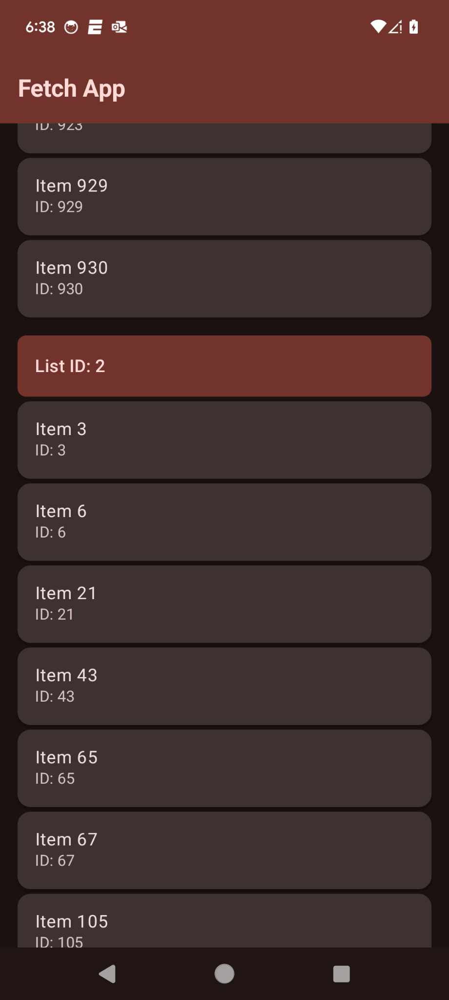
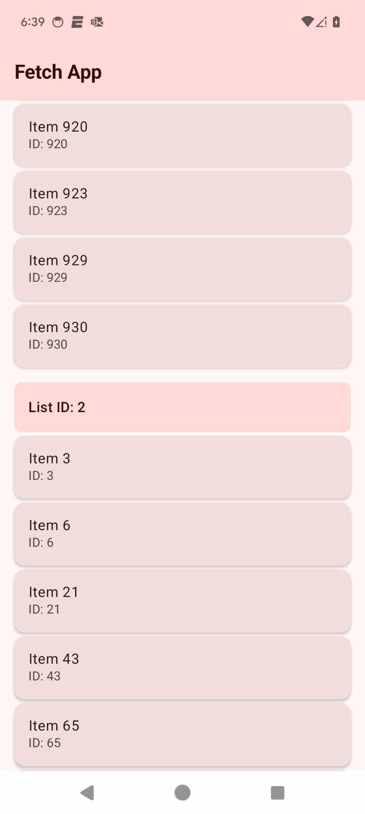

# Fetch code challenge

The goal of the sample is to showcase the current UI capabilities of Compose.

- Design pattern: Clean Architecture with MVI (Model-View-Intent) and Repository pattern
- Jetpack Compose for UI
- Kotlin Coroutine
- Hilts for DI
- Retrofit for network
- Added unit test for everything viewModel, repository and Api class

### Demo

